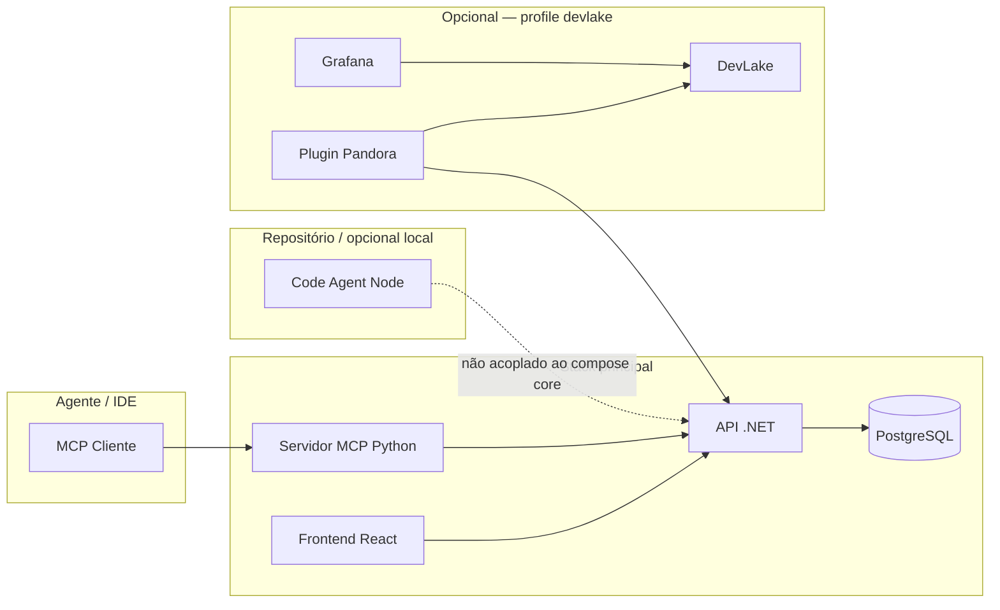

# Sistemas — visão geral

O repositório **Pandora SDD Task Manager** agrupa vários subsistemas que, juntos, formam uma plataforma **humano + agente** para Spec-Driven Development, Scrum, conhecimento e observabilidade opcional.

## Diagrama lógico

## Lista de sistemas

| Sistema | Pasta / artefato | Função |
|---------|-------------------|--------|
| **API** | `backend/AgenticTodoList.Api` | REST, domínio Scrum, wiki, checkpoints, métricas em tempo real, sync DevLake |
| **Frontend** | `frontend` | Dashboard, kanban, conhecimento, token insights |
| **MCP** | `mcp-server-python` | Ponte Model Context Protocol → API (ferramentas e recursos para agentes) |
| **PostgreSQL** | `docker-compose` + `ops/postgres` | Persistência; backups agendados e scripts em `ops/scripts` |
| **DevLake** | `ops/devlake`, profile `devlake` | Métricas DORA e integração com lake; Grafana para dashboards |
| **Code Agent** | `code-agent` | UI de coding com Ollama e sandbox; **independente** do compose principal |

## Portas (Docker Compose — stack principal)

| Serviço | Porta host |
|---------|------------|
| Frontend | 8400 |
| API | 8480 |
| MCP | 8481 |
| PostgreSQL | 8432 |

## Profile DevLake

Ativa serviços adicionais (MySQL do lake, DevLake, Config UI, Grafana, coletor). Ver [devlake-ops.md](devlake-ops.md).

## Decisão de fronteiras

- O **núcleo operacional** (tarefas, sprints, wiki) vive na API + Postgres; o MCP apenas **proxy** autenticado pela rede interna do compose.
- O **Code Agent** não é obrigatório para usar o Pandora SDD Task Manager; serve experimentação local com modelos via Ollama.
